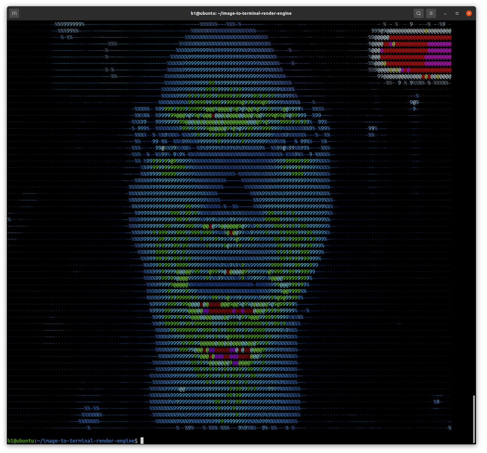
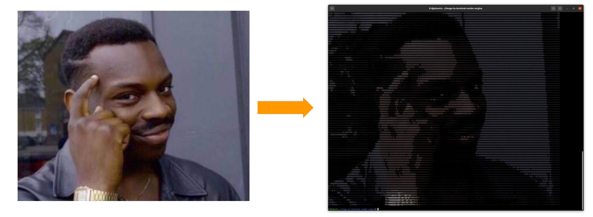

<h2 align=center><strong>TERMINAL RENDER ENGINE</strong></h2>

<p align=center>A barebone image to ASCII converter which adapts to unix terminal size.</p>

<h1 align=center></h1>

<h2 align=center><strong>SHOWCASE</strong></h2>


<br>



<br>
<br>

<h2 align=center><strong>USAGE</strong></h2>

Set the terminal to the most optimal size

```bash
render.py think.jpg
```



Import allows to use the module in full fashion

```python
from render import image, gif

# print with filled ascii (better for high resolution images)
image('cyber.png', printer=True, filled=True)
# ..
gif('halo.gif', loop=True)
```
